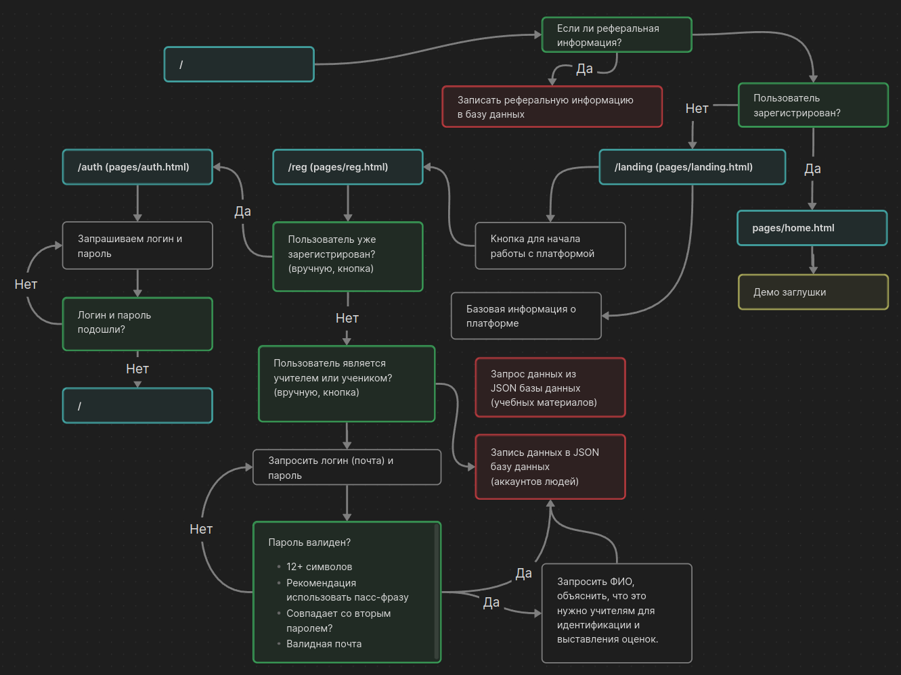

# edu-project

[](https://wakatime.com/badge/user/018cdef0-b6a0-4cba-ba74-ae713fa3eefc/project/c3dd14cd-c776-45e8-80e3-378b9a566d5c)

Проект представляет из себя платформу для создания и прохождения курсов. (Пока в разработке).

## Как развернуть проект (локально)

1. Клонируем репозиторий:

``` bash
git clone https://github.com/iamlostshe/edu-project.git
cd edu-project
```

> **ИНФО**
>
> Второй шаг для `windows` не обязателен, однако является хорошим тоном.

2. Создание и активация виртуального окружения (`venv`):

``` bash
python3 -m venv venv
. venv/bin/activate
```

> **ВАЖНО**
>
> Вторая команда для `windows` будет выглядеть так:
> ``` bash
> venv\Scripts\activate
> ```

3. Установка зависимостей:

``` bash
pip install -r requirements.txt
```

4. Запуск проекта:

``` bash
python3 main.py
```

## Планы на будующее

Вы можете просмотреть планы проекта [тут](TODO.md).

Общий приницип структуры проекта представлен на изображении ниже, нажмите на него, для детального просмотра:



## Обратная связь

Мы будем рады обратной связи по проекту, вы можете написать [разработчику в Telegaram](https://t.me/iamlostshe).
